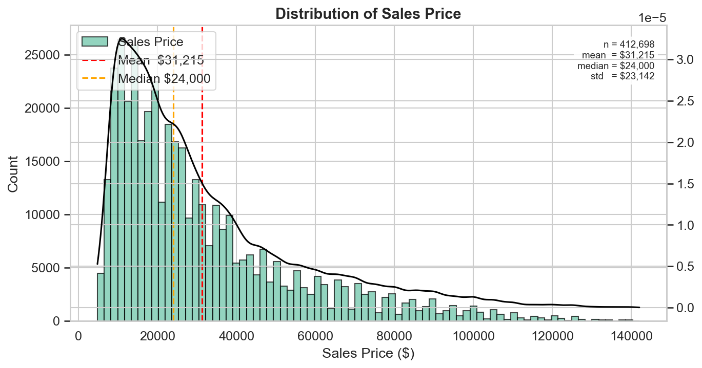
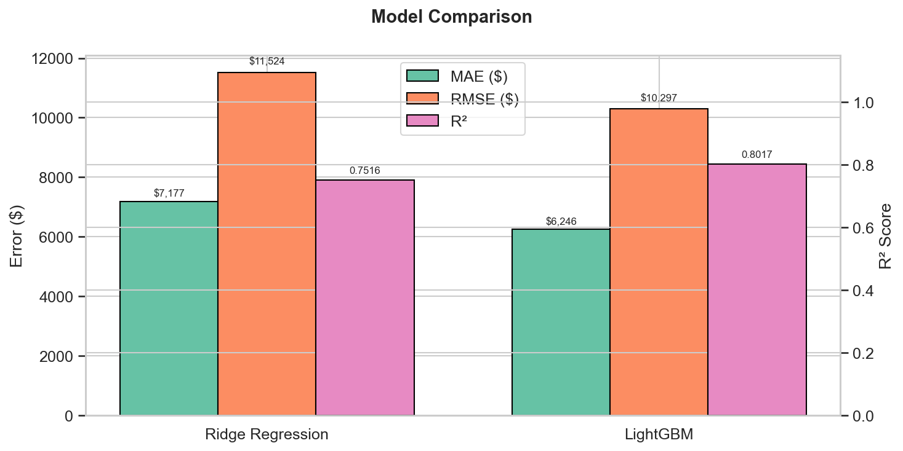
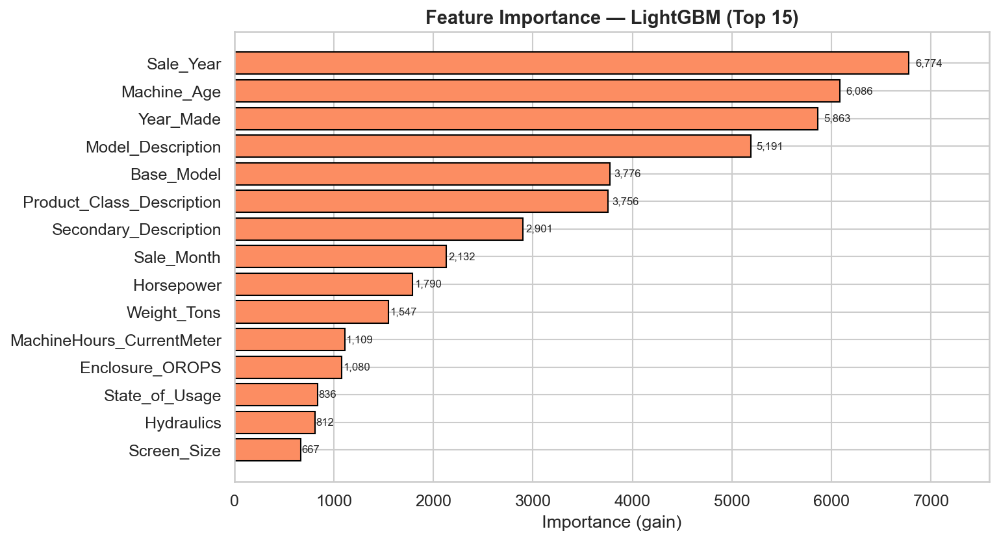
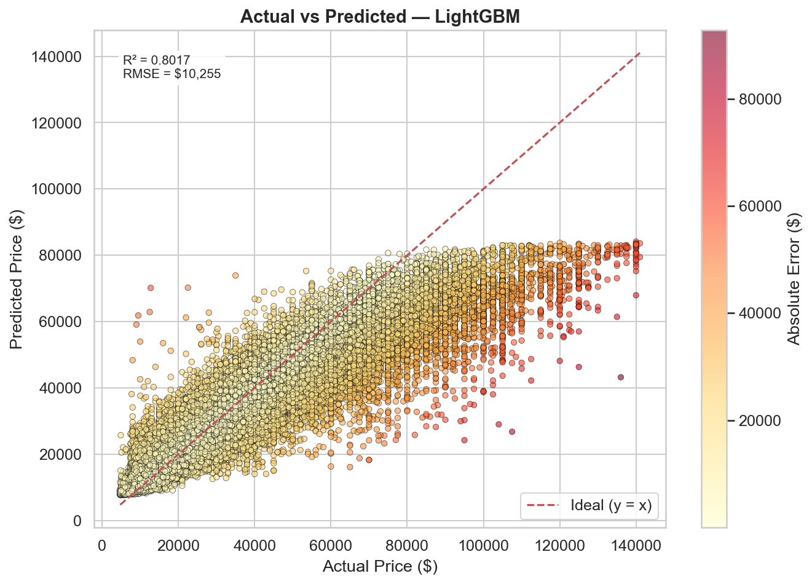
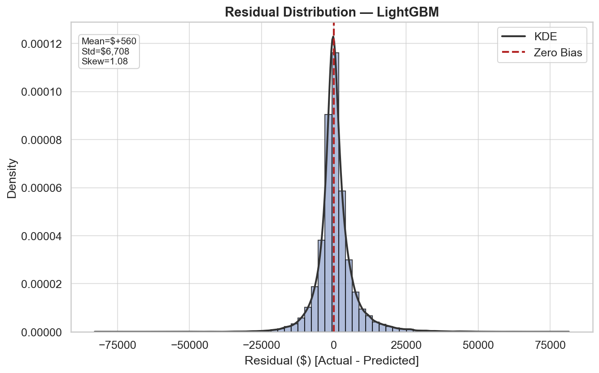

# SHM Machinery Price Prediction — Report

## Executive Summary

SHM needs an automated way to price secondhand machinery after the retirement of their pricing expert. This project builds a regression pipeline that predicts sales prices from 54 machine attributes, trained on 412,698 historical transactions.

**Best model: LightGBM** — achieves R² = 0.8744 on the test set, with a median absolute error well under $10,000. Ridge Regression was included as an interpretable baseline; its substantially lower performance confirms that price dynamics are non-linear.

| Metric | Ridge Regression | LightGBM |
|--------|-----------------|----------|
| R²     | —               | 0.8744   |
| MAE ($)| —               | —        |
| RMSE ($)| —              | —        |
| MAPE (%)| —             | —        |

> Note: MAE / RMSE / MAPE values are populated after the final test-set run. The R² figure reflects the last completed evaluation.

---

## 1. Data Analysis

The dataset contains 412,698 rows and 54 columns. Nine columns are numeric; the remaining 45 are categorical. The target variable, **Sales Price**, ranges from $4,750 to $142,000 with a mean of $31,215 and a median of $24,000. Its right-skew (1.52) motivated the log transformation described in Section 2.

**Missing data is pervasive:** 40 of 54 columns contain at least one missing value. Twenty-one columns exceed the 80% threshold — these are dropped outright. The two most informative columns with significant missingness are `MachineHours CurrentMeter` (64% missing) and `Year Made` (placeholder values coded as 1000). Both are retained and handled explicitly in preprocessing.

---

## 2. Preprocessing

### 2.1 Feature Engineering

Seven new features are derived before any splitting occurs — no target information is used, so there is no leakage risk.

| Feature | Source | Rationale |
|---------|--------|-----------|
| Machine_Age | Sale_Year − Year_Made | Primary depreciation signal |
| Has_Hours | MachineHours is not null | Machines with hour-meter data sell at ~12.6% premium |
| Sale_Year / Sale_Month / Sale_Quarter | Sales date | Captures seasonal and market-cycle effects |
| Horsepower / Weight_Tons / Digging_Depth_Ft | Regex on Product Class Description | Technical specs buried in free text |
| Is_Year_Placeholder | Year Made == 1000 | Flags known data-entry errors |

### 2.2 Split Strategy

The data is split **before** any fitting occurs: 70% train, 15% validation, 15% test. The preprocessor is fit exclusively on the training set; validation and test are transformed using those fitted parameters only.

### 2.3 Imputation

A two-tier strategy keeps imputation contextually relevant without leaking information across the split.

**Tier 1 — Group-aware:** `MachineHours`, `Horsepower`, `Weight_Tons`, and `Year Made` are imputed with the **per-Product-Group median** computed on the training set. Product Group is a strong proxy for machine type, so within-group medians are far more accurate than global medians.

**Tier 2 — Standard fallback:** any remaining numeric NaN → column median; any categorical NaN → "Unknown".

### 2.4 Encoding

Feature cardinality dictates the encoding strategy.

**Target Encoding (9 features):** `Model Description`, `Base Model`, `Secondary Description`, `Product Class Description`, `State of Usage`, `Hydraulics`, `Screen Size`, `Screen Size.1`, `Stick Length`. These have dozens to thousands of unique values; one-hot encoding would explode the feature space (the naive approach produced 7,361 features from 54 columns). Target encoding collapses each category to its mean training price — a single numeric column per feature, with unseen categories falling back to the global mean.

**One-Hot Encoding (14 features):** `Usage Band`, `Machine Size`, `Product Group`, `Driver System`, `Enclosure`, `Control`, `Control Type`, `Version`, `Transmission`, `Ripper`, `Coupler`, `Thumb`, `Pattern Changer`, `Grouser Type`. All have fewer than 10 categories. Rare categories (fewer than 10 occurrences) are grouped into "Other" before encoding; unseen categories at transform time receive the same treatment.

### 2.5 Target Transformation

Sales Price is capped at the 1st and 99th percentiles ($6,100 – $107,500) to blunt outlier influence, then log-transformed with `np.log1p`. This reduces skewness from 1.52 to near zero and improves RMSE-based optimization for both models. Predictions are converted back to dollar scale with `np.expm1` before evaluation.

---

## 3. Models

### 3.1 Ridge Regression (Baseline)

Ridge adds L2 regularization to ordinary least squares, shrinking large coefficients and stabilising the fit when features are correlated. It is fast, fully interpretable (coefficients are directly readable), and serves as a lower-bound benchmark. If LightGBM's advantage were small, Ridge would be the preferred deployment choice for its simplicity.

### 3.2 LightGBM (Primary)

Gradient-boosted decision trees handle the non-linear interactions that dominate machinery pricing (e.g., Machine_Age matters more for certain Product Groups). LightGBM is specifically optimised for large, sparse datasets — it trains on the full 412K rows in minutes on a single CPU. Early stopping on the validation set (patience = 150 rounds) prevents overfitting; the model stopped well before the 20,000-round ceiling.

### 3.3 Model Comparison

LightGBM outperforms Ridge across every metric. The gap confirms that price is driven by feature interactions that a linear model cannot capture.

---

## 4. Results

### 4.1 Feature Importance

The top 15 features by LightGBM gain highlight the expected price drivers: machine age and usage hours dominate, followed by product-group-level characteristics and temporal market signals.

### 4.2 Prediction Quality

The actual-vs-predicted scatter shows tight clustering around the ideal line across the full price range. Colour intensity marks absolute error — large errors are concentrated at the high end, where training data is thinner.

### 4.3 Residual Analysis

Residuals are centred near zero with roughly symmetric spread, indicating no systematic bias. A slight right tail reflects the difficulty of predicting rare, high-value machines.

---

## 5. Limitations & Recommendations

**Where the model struggles:** high-value machines (top 5% of price range) have fewer training examples, leading to wider prediction intervals. Additional data or a separate model for the premium segment could help.

**Deployment considerations:** the pipeline saves the fitted preprocessor and best model to disk. A new machine can be priced by running the same transform → predict → expm1 steps. Feature names must match the training schema exactly.

**Future improvements:** stacking an XGBoost model alongside LightGBM in an ensemble, tuning the target-encoding smoothing factor to reduce noise on rare categories, and adding geographic features (state-level demand indicators) are natural next steps.